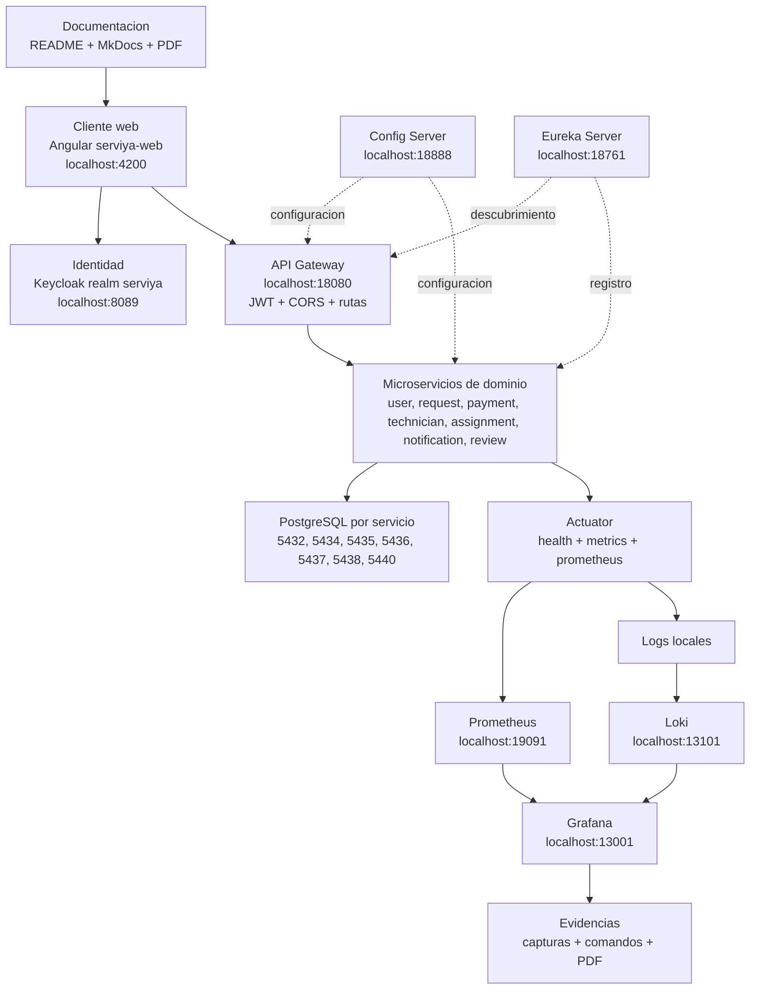
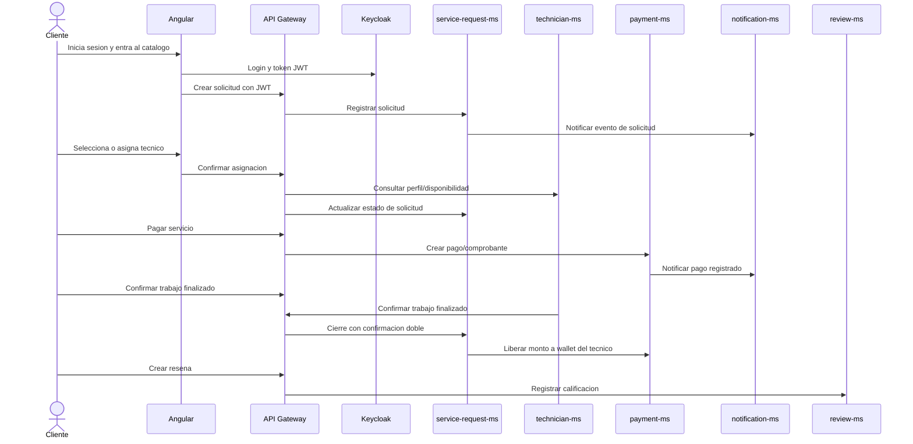
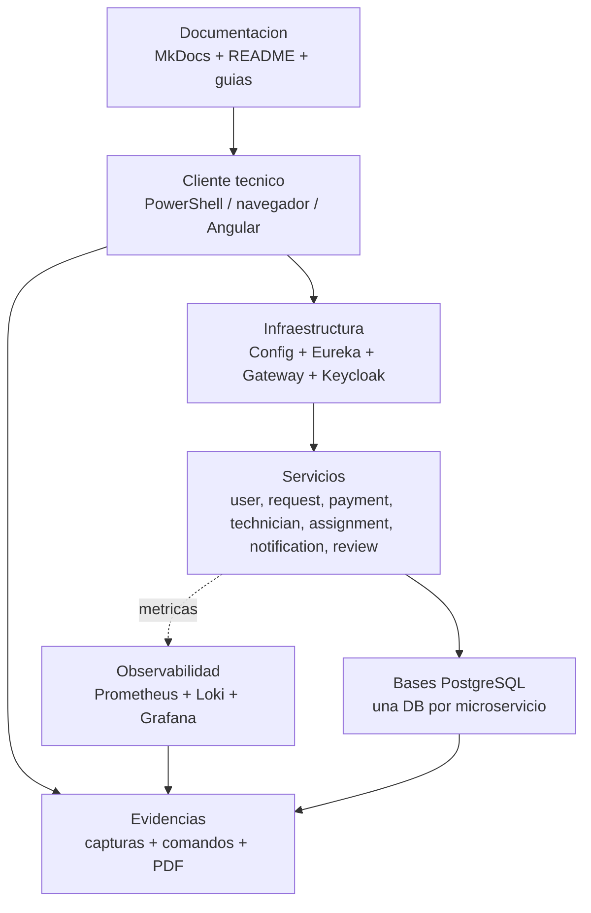
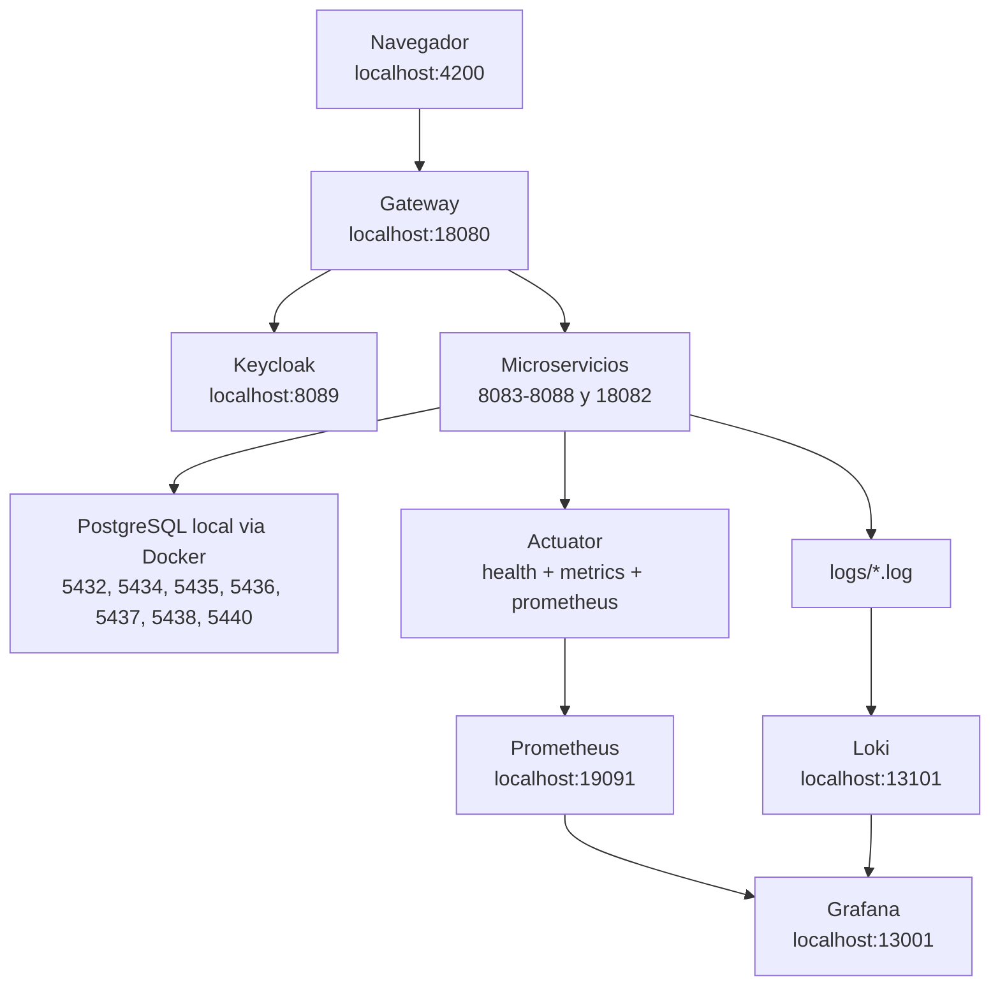

# Arquitectura del producto ServiYa v2

ServiYa v2 es una plataforma distribuida para gestionar servicios tecnicos: registro de usuarios, postulacion de tecnicos, catalogo de servicios, solicitudes, asignaciones, pagos, billetera, resenas, notificaciones y monitoreo. El producto esta separado en una aplicacion Angular, una capa de infraestructura y microservicios Spring Boot con bases de datos PostgreSQL independientes.

## Proposito de la arquitectura

La arquitectura busca que cada capacidad del negocio pueda evolucionar de forma separada. El frontend consume una unica entrada HTTP mediante el API Gateway, la seguridad se centraliza con Keycloak, la configuracion se publica desde Config Server y los servicios se registran en Eureka. Para la defensa tecnica, esto permite explicar el sistema completo por capas y no como una sola aplicacion monolitica.

## Vista general de contenedores

## Capas del sistema

| Capa | Componentes | Responsabilidad |
| --- | --- | --- |
| Presentacion | `clients/serviya-web` | Interfaz web por rol, rutas protegidas, consumo del gateway y pantallas de operacion. |
| Entrada HTTP | `infra/gateway` | Enrutamiento por prefijo, CORS, validacion JWT y control de acceso por rol. |
| Identidad | `infra/keycloak` | Login, emision de tokens, realm `serviya`, roles y usuarios de prueba. |
| Configuracion | `infra/config` + `infra/config/config-repo` | Propiedades centralizadas para servicios, seguridad, datasource, Eureka y observabilidad. |
| Descubrimiento | `infra/eureka` | Registro de servicios y consulta de instancias disponibles. |
| Dominio | `services/*` | Reglas de negocio separadas por contexto: usuarios, solicitudes, pagos, tecnicos, asignaciones, notificaciones y resenas. |
| Datos | PostgreSQL por servicio | Persistencia aislada por microservicio para reducir acoplamiento. |
| Observabilidad | Prometheus, Grafana, Loki, Promtail | Metricas, salud, latencia, errores y logs centralizados para diagnostico. |

## Microservicios y datos

| Servicio | Ruta | Puerto app | Base de datos | Puerto DB | Responsabilidad principal |
| --- | --- | ---: | --- | ---: | --- |
| `user-ms` | `services/user-ms` | 18082 | `serviya_user` | 5432 | Usuarios, perfil, administracion de cuentas e integracion con Keycloak. |
| `service-request-ms` | `services/service-request-ms` | 8084 | `service_request_ms` | 5434 | Solicitudes, catalogo operativo, estados, cotizaciones y cierre del servicio. |
| `payment-ms` | `services/payment-ms` | 8083 | `serviya_payment` | 5435 | Pagos, comprobantes, billetera del tecnico y liquidaciones. |
| `technician-ms` | `services/technician-ms` | 8085 | `technician_ms` | 5436 | Postulacion, documentos, especialidades, disponibilidad, ubicacion y portafolio. |
| `assignment-ms` | `services/assignment-ms` | 8086 | `assignment_ms` | 5440 | Asignaciones y ofertas relacionadas con tecnicos. |
| `notification-ms` | `services/notification-ms` | 8087 | `notification_ms` | 5438 | Notificaciones internas por usuario y eventos del sistema. |
| `review-ms` | `services/reviews-ms` | 8088 | `review_ms` | 5437 | Calificaciones, respuestas y moderacion de resenas. |

## Rutas publicadas por el Gateway

El gateway expone una ruta por microservicio usando prefijos estables. Cada ruta aplica `StripPrefix=1`, por lo que el microservicio recibe la ruta interna sin el prefijo.

| Prefijo externo | Servicio destino | Uso esperado |
| --- | --- | --- |
| `/user-ms/**` | `user-ms` | Usuarios, perfiles, admin de usuarios. |
| `/service-request-ms/**` | `service-request-ms` | Catalogo, solicitudes y estados del servicio. |
| `/payment-ms/**` | `payment-ms` | Checkout, pagos, historial, wallet y liquidaciones. |
| `/technician-ms/**` | `technician-ms` | Postulacion, documentos, perfil tecnico y disponibilidad. |
| `/assignment-ms/**` | `assignment-ms` | Asignaciones y ofertas. |
| `/notification-ms/**` | `notification-ms` | Bandeja de notificaciones. |
| `/review-ms/**` | `review-ms` | Resenas de clientes, tecnicos y administracion. |

## Modulos visibles en el frontend

| Rol | Rutas principales | Funcionalidad visible |
| --- | --- | --- |
| Cliente | `/cliente`, `/cliente/servicios`, `/cliente/solicitudes`, `/cliente/checkout`, `/cliente/pagos`, `/cliente/resenas` | Buscar servicios, crear solicitudes, asignar tecnico, pagar, confirmar finalizacion y calificar. |
| Tecnico | `/tecnico`, `/tecnico/postulacion`, `/tecnico/documentos`, `/tecnico/ofertas`, `/tecnico/servicios`, `/tecnico/wallet`, `/tecnico/resenas` | Postular, completar perfil, responder ofertas, confirmar trabajo, revisar billetera y responder resenas. |
| Trabajador | `/trabajador` | Operacion interna segun rol asignado. |
| Admin | `/admin`, `/admin/usuarios`, `/admin/catalogo/servicios`, `/admin/monitor`, `/admin/pagos`, `/admin/reportes` | Administracion, monitoreo, catalogos, pagos, solicitudes, reportes y configuracion. |

## Flujo funcional principal

## Revision tecnica en DEV

Esta vista resume como se valida el producto durante desarrollo local. Se parece al flujo que se pide en las sesiones de cierre tecnico: documentacion, cliente, infraestructura, servicios, observabilidad y evidencias.

Checklist DEV:

| Paso | Evidencia esperada |
| --- | --- |
| Levantar Keycloak y bases PostgreSQL | Contenedores `serviya-*` activos en Docker. |
| Levantar Config Server, Eureka y Gateway | `health=UP` y servicios visibles en Eureka. |
| Levantar microservicios | Endpoints `/actuator/health` responden `UP`. |
| Abrir Angular | `http://localhost:4200` muestra login y modulos por rol. |
| Ejecutar flujo cliente-tecnico | Solicitud creada, pago registrado, doble confirmacion y resena. |
| Revisar observabilidad | Prometheus con targets activos y Grafana con metricas. |

## Revision tecnica en PROD local

Para una defensa local, la maquina funciona como entorno de integracion: Docker aloja dependencias, Maven ejecuta servicios Spring Boot y Angular corre el cliente web. No es nube productiva, pero si permite demostrar el producto completo con infraestructura real.

## Puntos tecnicos para sustentar

- Separacion por contexto: cada microservicio tiene responsabilidad, puerto y base de datos propia.
- Seguridad centralizada: Angular obtiene token de Keycloak y el gateway/servicios validan JWT del realm `serviya`.
- Comunicacion controlada: el frontend no llama directo a cada servicio, entra por `api-gateway`.
- Configuracion reproducible: los YAML centralizados viven en `infra/config/config-repo`.
- Diagnostico: Actuator expone `health`, `metrics` y `prometheus`; Grafana muestra estado, latencia y errores.
- Flujo de negocio completo: solicitud, tecnico, pago, confirmacion doble, billetera, resena y notificacion.

