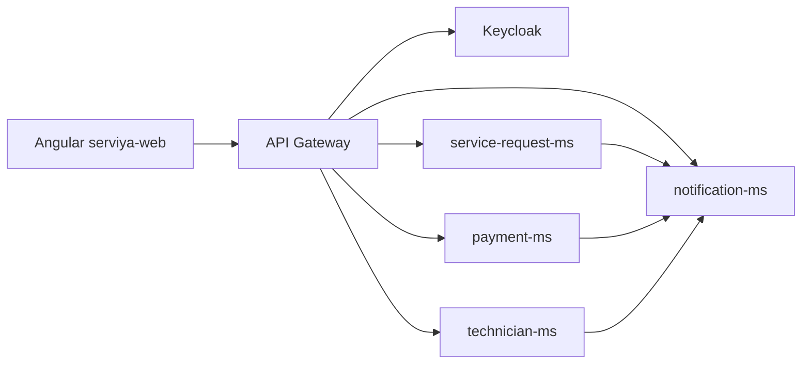

# Arquitectura

ServiYa esta organizado como una plataforma de microservicios con frontend Angular, API Gateway, Keycloak y servicios de dominio independientes.

## Componentes

| Componente | Ruta | Responsabilidad |
| --- | --- | --- |
| Frontend | `clients/serviya-web` | Interfaz para cliente, tecnico, trabajador y admin. |
| API Gateway | `infra/gateway` | Enrutamiento, CORS y autorizacion por roles. |
| Keycloak | `infra/keycloak` | Autenticacion, usuarios y roles. |
| Config Server | `infra/config` | Configuracion centralizada. |
| Eureka Server | `infra/eureka-server` | Descubrimiento de servicios. |
| notification-ms | `services/notification-ms` | Notificaciones in-app por usuario. |
| service-request-ms | `services/service-request-ms` | Solicitudes, cotizaciones, estados y asignacion. |
| payment-ms | `services/payment-ms` | Intenciones de pago, comprobantes y eventos de pago. |
| technician-ms | `services/technician-ms` | Postulacion, documentos, perfil y aprobacion de tecnicos. |

## Flujo general

## Reglas de seguridad

- El frontend consume los servicios mediante el gateway.
- Los endpoints protegidos validan JWT emitido por Keycloak.
- Las notificaciones internas se crean desde otros microservicios usando Feign hacia `notification-ms`.
- Las lecturas de notificaciones se filtran por el usuario autenticado.
