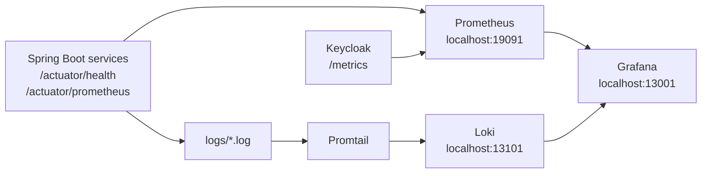

# Observabilidad y diagnostico

ServiYa v2 incorpora observabilidad para que la defensa tecnica no dependa solo de pantallas. La plataforma expone salud, metricas HTTP, latencia, errores y logs mediante Actuator, Prometheus, Loki, Promtail y Grafana.

## Arquitectura de observabilidad



## URLs locales

| Herramienta | URL | Uso en defensa |
| --- | --- | --- |
| Prometheus | `http://localhost:19091` | Revisar targets, consultas `up`, requests y latencia. |
| Grafana | `http://localhost:13001` | Mostrar dashboard de salud, trafico y errores. |
| Loki | `http://localhost:13101` | Almacenar logs consultables desde Grafana. |
| Eureka | `http://localhost:18761` | Confirmar registro de servicios. |

Credenciales Grafana en desarrollo:

```text
usuario: admin
password: admin
```

## Targets esperados en Prometheus

Prometheus toma metricas desde `infra/observability/prometheus/prometheus-dev.yml`.

| Target | Aplicacion |
| --- | --- |
| `host.docker.internal:18888` | `config-server` |
| `host.docker.internal:18761` | `eureka-server` |
| `host.docker.internal:18080` | `api-gateway` |
| `host.docker.internal:18082` | `user-ms` |
| `host.docker.internal:8083` | `payment-ms` |
| `host.docker.internal:8084` | `service-request-ms` |
| `host.docker.internal:8085` | `technician-ms` |
| `host.docker.internal:8086` | `assignment-ms` |
| `host.docker.internal:8087` | `notification-ms` |
| `host.docker.internal:8088` | `review-ms` |
| `host.docker.internal:8089` | `keycloak` |

## Que debe mostrar Grafana

| Seccion | Paneles | Interpretacion |
| --- | --- | --- |
| Salud general | Estado UP/DOWN por servicio | Permite detectar servicios caidos durante la demo. |
| Trafico HTTP | Requests por segundo por aplicacion | Demuestra que el frontend esta generando llamadas reales. |
| Latencia | Percentil p95 | Identifica servicios lentos o endpoints pesados. |
| Errores | Conteo 4xx/5xx | Separa errores de permisos/rutas de fallos internos. |
| JVM | CPU y memoria | Ayuda a sustentar estabilidad del backend. |
| Logs | Entradas por servicio | Permite revisar trazas y excepciones. |

## Consultas PromQL utiles

Estado de targets:

```promql
up
```

Requests por segundo:

```promql
sum by (application) (rate(http_server_requests_seconds_count[5m]))
```

Errores 4xx y 5xx:

```promql
sum by (application, status) (rate(http_server_requests_seconds_count{status=~"4..|5.."}[5m]))
```

Latencia p95:

```promql
histogram_quantile(0.95, sum by (le, application) (rate(http_server_requests_seconds_bucket[5m])))
```

## Pasos de diagnostico durante la defensa

1. Abrir Eureka y confirmar que los servicios estan registrados.
2. Abrir Prometheus > Status > Targets y verificar que los targets esten `UP`.
3. Abrir Grafana y mostrar el dashboard general.
4. Ejecutar una accion en Angular, por ejemplo crear o consultar una solicitud.
5. Volver a Grafana y mostrar que suben los requests del gateway y del microservicio correspondiente.
6. Si ocurre un error, revisar si es `401/403`, `404`, `5xx` o si un servicio esta caido.

## Diagnostico por sintomas

| Sintoma | Donde mirar | Posible causa |
| --- | --- | --- |
| Frontend carga pero no trae datos | Consola navegador, Gateway, Grafana | Token invalido, ruta incorrecta o gateway apagado. |
| Servicio no aparece en Grafana | Prometheus Targets | Servicio no levantado o Actuator no expuesto. |
| `401`/`403` | Keycloak, token JWT, roles | Usuario sin rol requerido o sesion vencida. |
| `5xx` | Logs del microservicio y Loki | Excepcion interna, base caida o dependencia no disponible. |
| Alta latencia | Panel p95 y logs | Base de datos lenta, llamada Feign o endpoint pesado. |

## Evidencias para entregar

- Captura de Grafana con todos los servicios esperados.
- Captura de Prometheus Targets en estado `UP`.
- Captura de Eureka con microservicios registrados.
- Captura del flujo funcional en Angular.
- PDF exportado desde MkDocs con esta guia y la arquitectura del producto.
