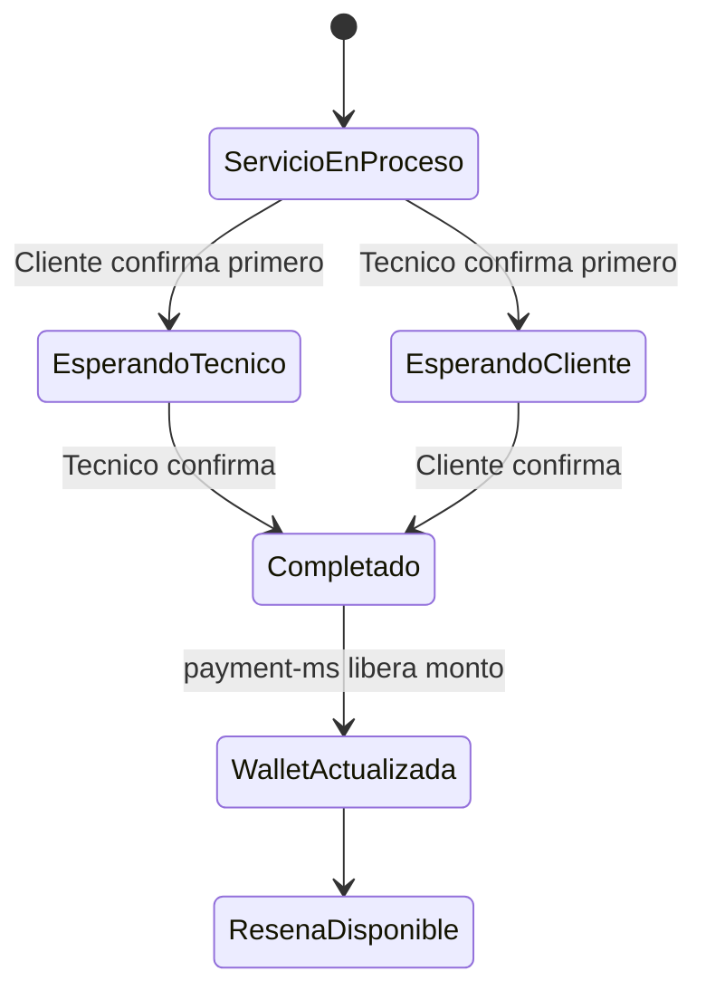

# Walkthrough funcional del sistema

Este walkthrough muestra el recorrido completo que se debe demostrar en la defensa tecnica. El objetivo es que el jurado vea que ServiYa no solo tiene pantallas, sino un flujo distribuido donde intervienen frontend, gateway, seguridad, microservicios, bases de datos, eventos y observabilidad.

## Actores

| Actor | Modulo Angular | Acciones principales |
| --- | --- | --- |
| Cliente | `/cliente` | Buscar servicios, crear solicitudes, pagar, confirmar cierre y calificar. |
| Tecnico | `/tecnico` | Postular, completar perfil, recibir ofertas, atender servicios, confirmar cierre y revisar wallet. |
| Trabajador | `/trabajador` | Apoyo operativo segun permisos asignados. |
| Admin | `/admin` | Gestion de usuarios, tecnicos, catalogo, pagos, solicitudes, reportes y monitoreo. |

## Recorrido 1: ingreso seguro

1. El usuario abre `http://localhost:4200`.
2. Angular redirige al login cuando no existe sesion activa.
3. Keycloak autentica al usuario y emite un JWT del realm `serviya`.
4. El frontend aplica guardias de autenticacion y rol.
5. El gateway y los microservicios validan el token antes de procesar endpoints protegidos.

Evidencia sugerida:

- Captura de login.
- Captura de ruta protegida por rol.
- Captura de respuesta `401/403` cuando se intenta entrar sin permisos.

## Recorrido 2: cliente crea una solicitud

1. El cliente entra al catalogo en `/cliente/servicios`.
2. Selecciona un servicio y revisa el detalle.
3. Crea una solicitud desde `/cliente/solicitudes/nueva`.
4. Angular envia la peticion al gateway.
5. El gateway enruta hacia `service-request-ms`.
6. `service-request-ms` guarda la solicitud en `service_request_ms`.
7. `notification-ms` registra o expone notificaciones relacionadas al evento.

Resultado esperado:

| Elemento | Resultado |
| --- | --- |
| Frontend | La solicitud aparece en `/cliente/solicitudes`. |
| Backend | `service-request-ms` responde correctamente. |
| Datos | Existe registro en la base `service_request_ms`. |
| Observabilidad | Aparecen requests en Prometheus/Grafana para gateway y servicio. |

## Recorrido 3: tecnico postula y atiende

1. Un usuario con rol tecnico entra a `/tecnico/postulacion`.
2. Completa datos, documentos, especialidades, disponibilidad y ubicacion.
3. El administrador puede revisar postulaciones desde `/admin/tecnicos/postulaciones`.
4. Cuando el tecnico esta habilitado, puede ver ofertas o asignaciones en `/tecnico/ofertas` y `/tecnico/servicios`.
5. Al aceptar o atender un servicio, el estado se actualiza mediante los servicios de solicitud/asignacion.

Evidencia sugerida:

- Perfil tecnico completo.
- Documento o postulacion visible.
- Oferta o servicio asignado.
- Estado actualizado en pantalla.

## Recorrido 4: pago y comprobante

1. El cliente entra a checkout desde `/cliente/checkout`.
2. El frontend consume `/payment-ms/**` mediante el gateway.
3. `payment-ms` registra pago o intencion de pago en `serviya_payment`.
4. El cliente puede revisar historial en `/cliente/pagos`.
5. El administrador puede monitorear pagos desde `/admin/pagos` o reportes.

Evidencia sugerida:

| Vista | Que mostrar |
| --- | --- |
| Cliente | Checkout y pagos realizados. |
| Admin | Monitor o historial de pagos. |
| Observabilidad | Requests a `payment-ms` y latencia del endpoint. |

## Recorrido 5: confirmacion doble y wallet

ServiYa implementa una regla importante del negocio: el trabajo no se cierra solo con una parte. Cliente y tecnico deben confirmar la finalizacion.



Resultado esperado:

- Si el cliente confirma primero, la pantalla queda esperando al tecnico.
- Si el tecnico confirma primero, la pantalla queda esperando al cliente.
- Solo cuando ambos confirman, la solicitud pasa a `COMPLETADO`.
- `payment-ms` libera el monto a la wallet del tecnico.
- El tecnico puede revisar su wallet en `/tecnico/wallet`.
- El cliente puede registrar una resena.

## Recorrido 6: resenas y respuesta

1. Cuando el servicio termina, el cliente accede a `/cliente/resenas/nueva/:serviceRequestId`.
2. El gateway enruta hacia `review-ms`.
3. `review-ms` guarda la calificacion en `review_ms`.
4. El tecnico revisa resenas en `/tecnico/resenas`.
5. El tecnico puede responder desde `/tecnico/resenas/:id/responder`.
6. El admin revisa moderacion o detalle desde `/admin/resenas`.

## Recorrido 7: monitoreo operativo

Durante la demo, abrir:

| Herramienta | URL | Que explicar |
| --- | --- | --- |
| Eureka | `http://localhost:18761` | Servicios registrados y disponibles. |
| Grafana | `http://localhost:13001` | Estado, trafico, errores y latencia. |
| Prometheus | `http://localhost:19091` | Targets activos y consultas PromQL. |
| Keycloak | `http://localhost:8089` | Realm, usuarios y roles. |

Consultas utiles en Prometheus:

```promql
up
```

```promql
sum by (application) (rate(http_server_requests_seconds_count[5m]))
```

```promql
histogram_quantile(0.95, sum by (le, application) (rate(http_server_requests_seconds_bucket[5m])))
```

## Guion corto para sustentar

1. Presentar la arquitectura: Angular, Gateway, Keycloak, Config, Eureka, microservicios y observabilidad.
2. Mostrar login y rutas por rol.
3. Crear una solicitud como cliente.
4. Mostrar tecnico y asignacion/oferta.
5. Registrar pago.
6. Confirmar cierre desde ambas partes.
7. Mostrar wallet y resena.
8. Cerrar con Grafana/Prometheus para evidenciar salud, trafico y errores.
